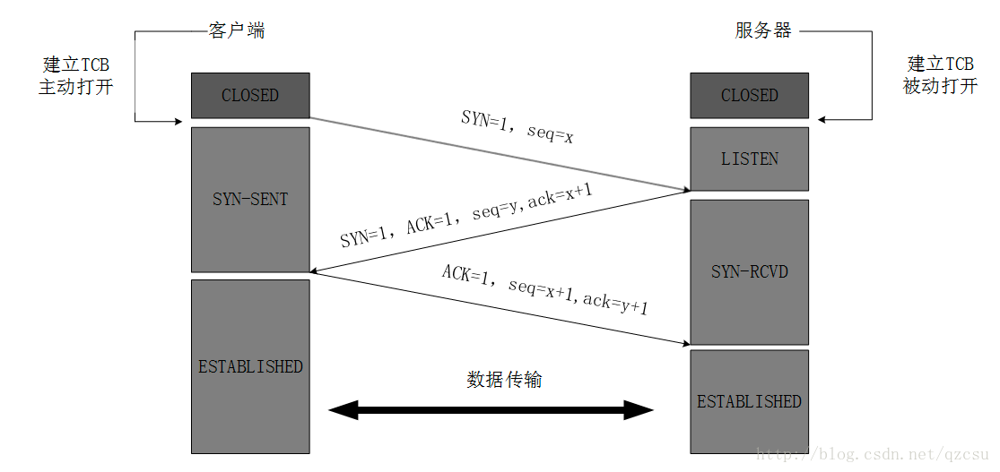

### TCP连接的状态

+LISTEN                     服务器在等待进入呼叫
+SYN_RECV                   一个连接请求已经到达，等待确认
+SYN_SENT                   应用已经开始，打开一个连接
+ESTABLISHED                连接已经建立，正常数据传输状态
+FIN_WAIT1                  连接一端（应用）完成数据传输，主动关闭
+FIN_WAIT2                  主动关闭一端收到另一端释放连接的确认
+ITMED_WAIT                 等待所有分组死掉
+CLOSING                    两边同时常识关闭
+TIME_WAIT                  另一边已初始化一个释放
+CLOSE_WAIT                 连接一端被动关闭
+LAST_ACK                   等待所有分组死掉
+CLOSE                      无连接是活动的或正在进行

#### 三次握手中第二次握手丢失会发生什么？
    过程：
    1、客户端向服务端发出握手报文，请求建立 TCP 连接，即第一次握手【SYN=1, ACK=0, Seq=x】
    2、服务端向客户端回复 SYN+ACK 包，但是这个包在网络中丢失了
    3、客户端等啊等，一直等不到服务端的 SYN+ACK，以为自己的 SYN 丢了，触发超时重传机制，向服务端又发了一个【SYN=1, ACK=0, Seq=z】
    4、服务端也知道自己的 SYN+ACK 丢了，于是又重传了若干次 SYN+ACK。这时服务端突然收到了客户端重传的【SYN=1, ACK=0, Seq=z】。根据 RFC5691 指出：为了减轻通过 SYN 标志位进行的 RST 攻击（Blind Reset Attack Using the SYN Bit）的影响，服务端此时应立即发送一个【ACK=1, Seq=y, Ack=x+1】给客户端，用以重置连接。
    5、客户端在接收到 【ACK=1, Seq=y, Ack=x+1】后，立即回复【RST=1, Seq=x+1】。此处的 Seq=x+1 表明：这个 RST 是前面那个 ACK：【ACK=1, Seq=y, Ack=x+1】引起的。然后，双方断开连接。
    至此，服务端第二次握手的 SYN+ACK 包丢失，最终导致了客户端“莫名其妙”地发出 RST 包。
    
    PS：KleeNet 论文中指出服务端回复 ACK 给客户端是因为服务端忽略了重传报文的 SYN 标志位，并认为这是一个 BUG。而实际上，这并不是一个 BUG，而是 TCP 为了减轻通过 SYN 标志位进行的 RST 攻击（Blind Reset Attack Using the SYN Bit）的影响 ，有意为之的。

#### RST是什么
    （Blind Reset Attack Using the SYN Bit）使用 SYN 位的盲复位攻击

#### 关于TCP协议中三次握手中的ACK和Ack number的区别
    一个是确认值(Acknowledgement)，为1便是确认连接。
    另一个是确认编号(Acknowledgement Number)，即接收到的上一次远端主机传来的seq然后+1，再发送给远端主机。提示远端主机已经成功接收上一次所有数据。
    
#### 三次握手中第三次握手丢失会发生什么？
        

#### 为什么不能两次握手进行连接？
    1、第三次握手是为了防止已经失效的连接请求报文突然又传到服务器，因而产生错误